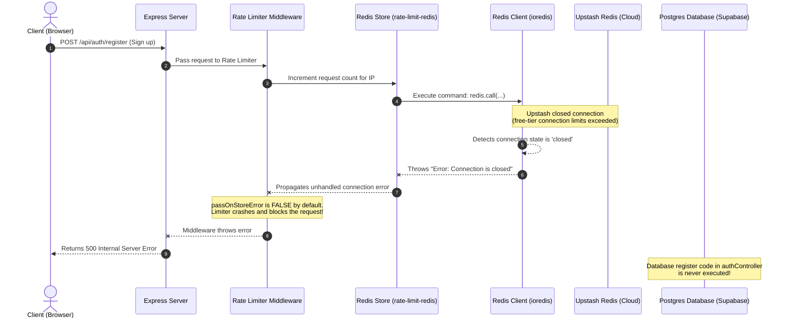

# 🔍 Redis Rate-Limiter Connection Issue Explained

This document details the root cause of the connection issues encountered with **Upstash Redis** during the signup flow, and how the architectural fix resolves it.

---

## 🛠️ The Architecture & The Failure Flow

When the `express-rate-limit` middleware uses a Redis store (`rate-limit-redis`) to track API request limits, it depends on an active Redis connection. On free-tier Upstash instances, idle connections are occasionally terminated. 

The sequence diagram below shows how a dropped Redis connection caused the registration request to crash with a `500 Internal Server Error` before the architectural fix was applied:



---

## 💡 The Architectural Fix

We resolved this by making the rate-limiting middleware **resilient to Redis connection drops** in `backend/src/middleware/rateLimiter.js`:

1. **`passOnStoreError: true`**:
   We enabled this built-in option in `express-rate-limit`. If the Redis store throws any connection or execution error (like `Connection is closed`), the rate-limiter catches the error, logs a warning, and **silently allows the request to pass through** instead of blocking it with a 500 error.

2. **Connection Status Safety Check**:
   Before sending a command to Redis, the custom `sendCommand` callback now verifies:
   ```javascript
   if (redis.status !== "ready") {
     throw new Error("Redis is not connected");
   }
   ```
   This prevents waiting for network timeouts and instantly triggers the graceful fallback when Redis is offline.

Now, even if Redis goes completely offline, your application continues to work flawlessly for all core operations (login, signup, etc.) using database verification!
